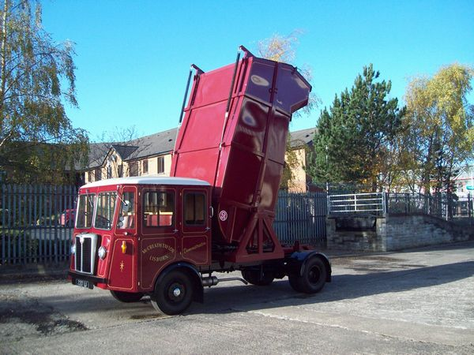
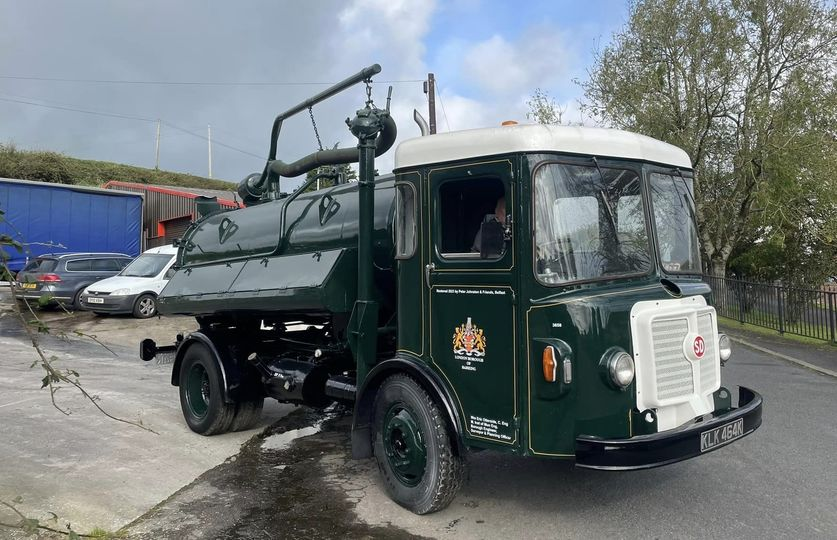
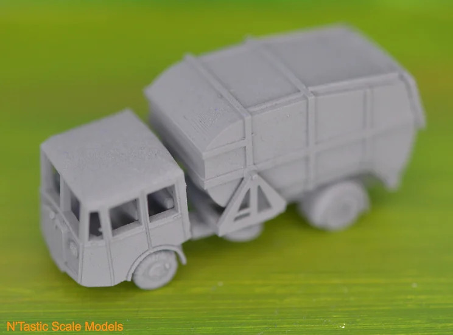
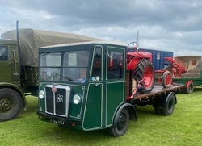
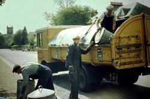

---
# Feel free to add content and custom Front Matter to this file.
# To modify the layout, see https://jekyllrb.com/docs/themes/#overriding-theme-defaults

layout: page
title: Enthusiasts' Club
background: '/assets/Images/Freighter Epsom.jpg'
---
When I launched the Unofficial Shelvoke &amp; Drewry Website in the Spring of 2002 it was a very happy coincidence that in January 2003 Channel 4 TV's Salvage Squad programme featured the ex-Isles of Scilly PN Revopak. By their linking to the Website names of former employees were soon being forwarded to me, and it seemed appropriate to launch a
Club for anyone with an interest in Shelvoke &amp; Drewry.

## Magazine

<figure class="figure w-100 text-center">
  
  <!--<figcaption class="figure-caption text-center">Preserved vehicle restored to 1922 condition.</figcaption>-->
</figure>

It soon became apparent that a means of communication was needed other than the Internet as many former employees weren't on the Internet. In March 2003 an A5 size quarterly magazine was launched and continued until the end of 2010 with 32 issues being produced. At its peak 160 copies were printed and posted per issue.
Until the later years printing, stapling, and posting was all done at home.

By 2010 this was felt to be too onerous and the magazine was replaced by an easily printable Newsletter on the webpage, and this practice continues with 37 issues having been produced to date. [April 2020]. Unfortunately this change inevitably meant that contact with some enthusiasts has been lost.

## Events

<figure class="figure w-100 text-center">
  
  <!--<figcaption class="figure-caption text-center">Preserved vehicle restored to 1922 condition.</figcaption>-->
</figure>

On September 12th 2004 the first event organised by the SD Enthusiasts' Club was held at Letchworth Hall Hotel's Arlington Suite, under the title 'SD Remembered'. This accommodates 200 people and all the tickets were sold with unfortunately a waiting list. A buffet supper was provided, memorabilia was displayed and seven preserved vehicles were on display.

In 2005 the Club were invited to attend the Bedfordshire Steam &amp; Country Fayre at Old Warden (near Bigglewade) on 17th &amp; 18th September. A display tent was provided and eight preserved vehicles were displayed and driven into the parade ring each day. The event was titled: 'SD Celebrated' and is shown above.

The 2006 event was more low key and was held at the Grange Community Centre, Letchworth Garden City, on 24th June. Just sixty people attended this event which consisted of a buffet meal and display of memorabilia. Steve Jones brought his 1982 PN Revopak over from the Isle of Wight for the event.

In 2009 the Club provided a stand at The Letchworth Garden City Industry Festival on 1st and 2and August. Relatives of James Drewry also provided a display. The "1922" Freighter was on display.

In 2009 &amp;2010 preserved vehicles were displayed at the Southern Counties Historic Vehicles Preservation Trust's rallies at Edenbridge, Kent, in June.

<figure class="figure w-100 text-center">
  
  <!--<figcaption class="figure-caption text-center">Preserved vehicle restored to 1922 condition.</figcaption>-->
</figure>

In November 2011 in conjunction with the Enthusiasts' Club, former SD apprentice, Bob Bowker, organised a reunion lunch [shown above] for former apprentices at the Letchworth Garden City Golf House. Former Managing Director, and an ex-SD apprentice, Stan Quin, addressed the gathering of over thirty former apprentices.

In 2022 Three events were organised to celebrate the Centenary of the founding of Shelvoke &amp; Drewry Ltd.in 1922. 

On 11th and 12th June at the British Motor Museum, Gaydon, Warwickshire's Annual Classic and Vintage Commercial Vehicle Gathering, three SD's and an SD built Latil were on display. Their attendance was organised by Malcolm Bates and Peter Johnston.

On Saturday 3rd September the Ulster Commercial Vehicle Club held a meeting at the Titanic Quarter in Belfast. This was followed by a twenty mile road run to Donaghadee, County Down. Five SD vehicles from Peter Johnston's collection took part in the run.

On Sunday 25th September an event was held sat the Broadway Hotel, Letchworth Garden City, with displays, memorabilia, refreshments and a "good old chat" attended by 75 people. This was organised by a small committee from the Enthusiasts' Club. Two preserved vehicles were in attendance. 

No further gatherings have been arranged to date.

<figure class="figure w-100 text-center">
  
  <!--<figcaption class="figure-caption text-center">Preserved vehicle restored to 1922 condition.</figcaption>-->
</figure> 
 
## Facebook

In January 2016 a Facebook Group was created as a further means of communication between SD enthusiasts. This has proved to be a successful way of keeping in touch. The Group numbers over 950 members.

Over the years many people have been generous in sharing their memories of Shelvoke &amp; Drewry and I believe that the Enthusiasts' Club has fulfilled its purpose of keeping memories of the Company alive.

To me it has provided many hours of interesting work which is continuing.

*Brian Carpenter. November 2023*

## Enthusiasts Club Newsletter

When the newsletter moved online, Brian provided a web version and a pdf version.

## PDF Verions of the Newsletter

<ul>

      
      
            <li><a href="{{ pdf.path | relative_url}}">Volume 2 {{pdf.name}}</a></li>
      
      

</ul>

### Newsletter Extras

<ul>

      
      
            <li><a href="{{ pdf.path | relative_url}}">Newsletter Extra - {{pdf.name}}</a></li>
      
      

</ul>

### Other PDFs

<ul>

      
      
      
            <li><a href="{{ pdf.path | relative_url}}">{{pdf.name}}</a></li>
      
      
      

</ul>

## Web Versions of the Newsletter
Below is the last web version he published.

### The SD Enthusiasts' Club Newsletter

#### Volume 2 Issue 52 Winter 2023

**Now in our Twentyfirst year of publication.**

**FINAL ISSUE**

**From the Editor**

It was with a very heavy heart that I wrote *Final Issue* above. 2023 has proved to be a very difficult year for me brought on, I believe by a Covid booster jab in October 2022. It feels almost unbelievable that so far the doctors I've been seeing have been unable to discover why week by week I've grown weaker and weaker.

One suggestion is that it's simply that I've had too many birthdays! So I felt I had to decide to release myself from the commitment to produce a Newsletter every quarter as I've done for over twenty years now.

I hope I've done justice to this final issue of the Newsletter.

On page 1 you'll find my plans for the future. I'll carry on as long as I'm able! 

On page 2 there is an account of the life of the Enthusiasts' Club and on page 3 a brief history of the company that tries to put some perspective on the successes and failures of the Companyy. 

Pge 4 looks at some of the people who are preserving the Shelvoke &amp; Drewry name.

We have news of surviving vehicles on page 5, and a News Bulletin on page 6. 

I hope you'll enjoy this issue.

*Brian Carpenter Editor 1st  December 2023* 

<i class="fa-solid fa-file-pdf"></i> A <a href="/files/Issue52.pdf">shortened version of the Newsletter is also available as a pdf</a> file for easy printing.

##### Index To Issue 52

  

      

      

            
      

      

      <h5 class="card-title">Page 1</h5>
      
Future Plans for the Newsletter.

      <a href="/pg1" class="btn btn-primary">Go to Page 1</a>
      

      

  

  

      

      

      
      

      

      <h5 class="card-title">Page 2</h5>
      
The SD Enthusiasts' Club's Achievements.

      <a href="/pg1#page-2" class="btn btn-primary">Go to Page 2</a>
      

      

  

  

      

      

      
      

      

      <h5 class="card-title">Page 3</h5>
      
A Brief History of the Company.

      <a href="/pg1#page-3" class="btn btn-primary">Go to Page 3</a>
      

      

  

  

      

      

            
      

      

      <h5 class="card-title">Page 4</h5>
      
Keeping the Name Alive in the 21st Century.

      <a href="/pg1#page-4" class="btn btn-primary">Go to Page 4</a>
      

      

  

  

      

      

      
      

      

      <h5 class="card-title">Page 5</h5>
      
Surviving SD Vehicles.

      <a href="/pg1#page-5" class="btn btn-primary">Go to Page 5</a>
      

      

  

  

      

      

      
      

      

      <h5 class="card-title">Page 6</h5>
      
News Bulletin.

      <a href="/pg1#page-6" class="btn btn-primary">Go to Page 6</a>
      

      

  

Click on any page above and enjoy the magazine.

#### Volume 2 Issue 51 Autumn 2023 

**In Publication since 2003**

**From the Editor**

I was delighted to see the slide rule described on page 2. 

I only knew that SD produced these from the Kaleidoscope book and it was so good to be able to get a better idea of the innovation. 

On page 1 I describe four photos I've received about the remarkable Freighter, which was the reason for the formation of Shelvoke &amp; Drewry Ltd. 

I was pleased to be able to pay tribute to Mrs. Freda Tassell who died recently. She had a truly remarkable career at S&amp;D. 

There are many other news articles here and again I'm grateful to all those people who send in the information that I'm able to use. I hope you enjoy the Newsletter.

*Brian Carpenter 1st September 2023*

<i class="fa-solid fa-file-pdf"></i> A <a href="/files/Issue51.pdf">shortened version of the Newsletter is also available as a pdf</a> file for easy printing.

##### Index To Issue 51

  

      

      

            
      

      

      <h5 class="card-title">Page 1</h5>
      
Some interesting SD Freighters.

      <a href="/p1" class="btn btn-primary">Go to Page 1</a>
      

      

  

  

      

      

      
      

      

      <h5 class="card-title">Page 2</h5>
      
The Last Days of the Horse Drawn Dustcart.

      <a href="/p1#page-2" class="btn btn-primary">Go to Page 2</a>
      

      

  

  

      

      

      
      

      

      <h5 class="card-title">Page 3</h5>
      
Mrs. Freda Tassell

      <a href="/p1#page-3" class="btn btn-primary">Go to Page 3</a>
      

      

  

  

      

      

            
      

      

      <h5 class="card-title">Page 4</h5>
      
The Model Scene.

      <a href="/p1#page-4" class="btn btn-primary">Go to Page 4</a>
      

      

  

  

      

      

      
      

      

      <h5 class="card-title">Page 5</h5>
      
News of Surviving SD Vehicles.

      <a href="/p1#page-5" class="btn btn-primary">Go to Page 5</a>
      

      

  

  

      

      

      
      

      

      <h5 class="card-title">Page 6</h5>
      
The Editor's Page.

      <a href="/p1#page-6" class="btn btn-primary">Go to Page 6</a>
      

      

  

Click on any page above and enjoy the magazine.

## CORRESPONDENCE
**Editor's Note**

Will correspondents please note that the editor reserves the right to shorten letters or e-mails submitted for
publication, and to edit them to provide greater clarity. 

All reasonable steps will be taken to try to ensure that the meaning in the letter, or e-mail, remains unaltered. 

The editor can not accept responsibility for the accuracy of correspondent's memories, nor his own memories. Often we are looking back over many years, and our memories of an event may well vary. 

It would be appreciated if you would make it plain should you not wish your correspondence to be published for whatever reason.

