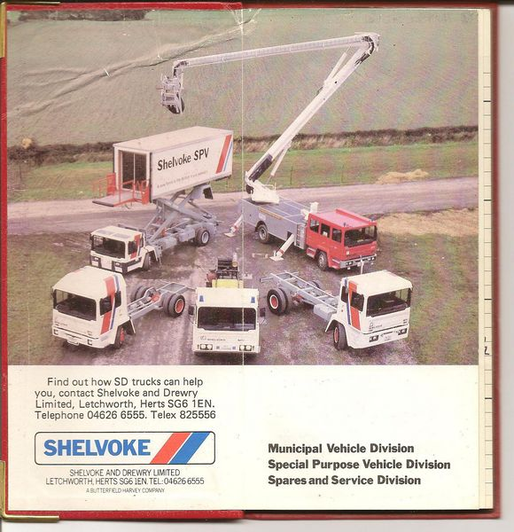

---
# Feel free to add content and custom Front Matter to this file.
# To modify the layout, see https://jekyllrb.com/docs/themes/#overriding-theme-defaults

layout: page
title: Gary's Boys
background: '/assets/Images6/p01.jpg'
---

This page was found on the webserver after Brian's death but marked as DRAFT 

## Gary's Boys DRAFT

### Gary Sugden in conversation with your Editor

<figure class="figure w-100 text-center">
  
  <!--<figcaption class="figure-caption text-center">Preserved vehicle restored to 1922 condition.</figcaption>-->
</figure>

When in a phone call Malcolm Bates mentioned that he'd recently visited Gary Sugden and that Gary had a lot of stories about Shelvoke's SPV Division, I thought it was too good an opportunity to miss.

There hasn't been a lot in the Newsletter, or it's predecessor the Magazine, about the SPV's. Many of my correspondents are more knowledgeable about SD's refuse collection vehicles, although there is considerable interest in the SPV Fire Appliances. So I welcomed the opportunity to redress the omission.

Much of the account that follows has been taken from Gary Sugden's words on the telephone, with additional material from  my archive of stories, and a lot of help from Malcolm Bates' writing in Vintage Roadscene Archive No.11 SD -Shelvoke &amp; Drewry. [Referred later in the text as Bookazine.]

The Photo at the top of the page of Gary's Boys was supplied to me by Roger Morrisroe.  Gary came to S&amp;D as a young man in 1960 having served an apprenticeship as a Motor Mechanic and joined the Service Department. Here he met up with John Hill, John Holt, Reg Bowles,Jim Morley (who served 46  years at the company) , Jack Fitch, Eric Kilfoyle, &#8220;Charlie&#8221; Lawton, Frank Hopgood among others. All under the control of Jack Arnold, the well respected Service Manager, who reported to Jack Wilkinson, Sales Director. Gary must have liked t he people he joined to work with, and the work, because he stayed in the Service Department for 17 years!

<figure class="figure w-100 text-center">
  
  <figcaption class="figure-caption text-center">A 1978/79 NY Revopak. Peter Jarman photo.</figcaption>
</figure>

Gary had close contact with Frank Dean who had joined the company as Chief Engineer from Dennis Bros,. along with Tom Tillson as Technical Director who between  them had overseen the successful design of the 'T' series Pakamatic. in 1959. On the retirement of Tom Tillson in 1979 Frank Dean was appointed Technical Director.

Gary was given freedom to recruit his own choices to his team, and looking back he remembers:- &#8220;I chose well. They were a brilliant bunch of workers.&#8221; The majority were quite young, and ex-SD apprentices, and Gary was impressed by the quality of the training they had received. &#8220;They were all good lads,&#8221; he told your Editor.

With time the team grew to 40 personnel &#8211; a far larger enterprise than your Editor had imagined.

Malcolm Bates records that for the 1976 Commercial Vehicle Exhibition at Earls Court only three examples of the SPV range were available.- the prototype Carmichael Type B Water Tender, 4x4 chassis, and two 13.5 ton gross airfield crash tenders. [Bookazine page 89]

<figure class="figure w-100 text-center">
  
  <figcaption class="figure-caption text-center">An early SPV Crash Tender (Not one of those mentioned above) Another Peter Jarman photo.</figcaption>
</figure>

For the 1978 Commercial Vehicle Exhibition, now held at the NEC at Birmingham, there was a far more impressive display of   seven vehicles  were on show. In that year the 'P' series of refuse collection vehicles had been launched with the Ogle designed all steel tilt cab , and for the SPV Division the PNL chassis formed the basis for  the PNL City Truck with the width increased by 2 ins to 6' 8&#8221;

<figure class="figure w-100 text-center">
  
  <figcaption class="figure-caption text-center">The PNL City Truck</figcaption>
</figure>

There was a 6x6, along with a CR 4x4 crash tender which was destined to go to Chubb to be equipped, an NYC 4x4 bodied as a water tanker, a WX type B water tender, a WY Firefighter chassis and an NYC Refueller unit for Air-BP. [Bookazine page 94]

The 1980 Commercial Vehicle Show appears to have been much more upbeat about the SPV Division. This Hi-loader aircraft supply vehicle was boldly emblazoned:- Shelvoke SPV &#8211; A new force in the British truck industry.&#8221; [Bookazine page 89]

<figure class="figure w-100 text-center">
  
  <figcaption class="figure-caption text-center">Photo supplied by Nigel Kenworthy.</figcaption>
</figure>

With great ingenuity Malcolm Bates had this used as the hospitality suite at the Exhibition, where valued guests walked up a staircase to the extended scissor lift and had a top level viewing platform over the NEC.

<figure class="figure w-100 text-center">
  
  <figcaption class="figure-caption text-center">This advert gives an idea of the range of SPV vehicles now available.</figcaption>
</figure>

And little Oliver, grandson of SD employees Jake &amp; Joan Saunders, does his bit to advertise the brand.

<figure class="figure w-100 text-center">
  
  <figcaption class="figure-caption text-center">Photo supplied by Joan Saunders.</figcaption>
</figure>

At the very same time Commercial Motor Magazine (25th October 1980) were reporting :- BEFORE Shelvoke and Drewry can implement plans to axe 35 jobs at Letchworth (CM, October 11), the company is considering making a further 64 workers redundant which would reduce the workforce by about ten per cent. A spokesman for the company said that its success at the Motor Show could ease the burden, and that options are being looked at.&#8221;

What a contrast!

Now imagine that SPV chassis line under the control of Gary and staffed by 'Gary's Boys.' The traditional refuse collector chassis had a wide range, but for Gary and his boys virtually every chassis was a new design that had to be mastered, drawings studied and decisions made. Perhaps it was the variety that welded them into such a good team. But in a very short time they became a force to be reckoned with. 

A major breakthrough came when it was realised that the 'P' series Ogle cab could be adapted and extended to form a fire appliance cab. An a good looking fire appliance came into being far in advance of the early appliances with bodywork and cabs by Carmichael. So good indeed that the London Fire Brigade ordered 48 WX's as Pump Escapes and  10 WY's with hydraulic platforms the bodywork was by Cheshire Fire Equipment (CFE).

<figure class="figure w-100 text-center">
  
  <figcaption class="figure-caption text-center">Photo at Lullingstone Castle 08.07.17. Two preserved LFB WX's Darren Perry photo.</figcaption>
</figure>

&#8220;They were great vehicle to drive,&#8221; said Gary, and the London firemen would agree, but  by then we talked for long enough, but I was itching to learn more from Gary about his 'Boys.'
